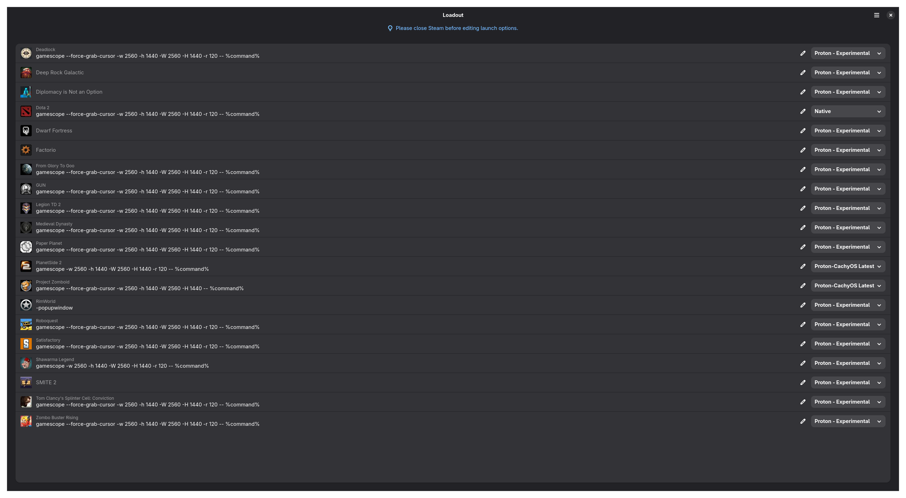

<h1 align="center">
  
  <br><br>
  Loadout
</h1>

<p align="center">
  <strong>Mass manage Steam launch options, Proton versions, and Gamescope presets</strong>
</p>

<p align="center">
  <a href="https://www.gnome.org/"></a>
  <a href="LICENSE"></a>
</p>

⚠️ This project is a work in progress and not intended for use.

## Features

- Scan installed Steam games
- View and edit launch options in bulk
- Apply Proton versions across multiple games
- Save reusable Gamescope presets
- Back up changes before writing them

[](assets/readme/sc1.png)

## Help wanted

The current logo was made by me and it is not great (credits to [Inkscape](https://inkscape.org/)), design is not my strong point.

If you are a designer and want to contribute a better icon/logo for Loadout, please open an issue or PR. I would be very grateful. Please do note I won't be accepting AI images.

## Build

```sh
meson setup build
meson compile -C build
```

## Run

```sh
meson devenv -C build src/loadout
```

## License

Loadout is licensed under the MIT License.

TLDR: Do what you like, I don't care!
